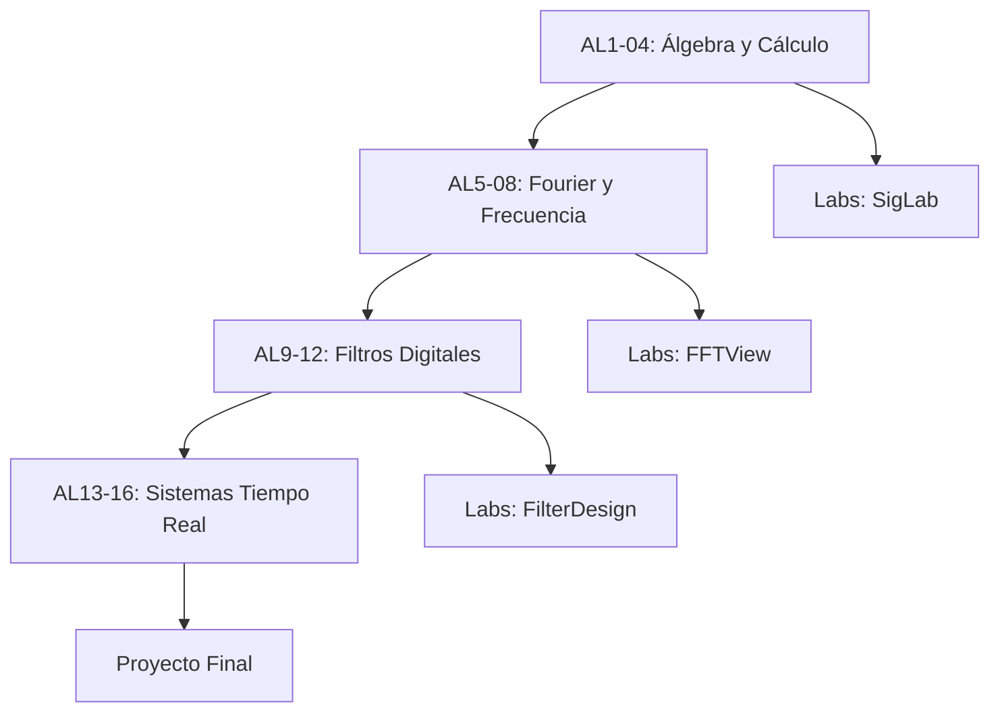

# Visión del Proyecto AudioLab University

## Misión

Proveer formación técnica de alto nivel en matemáticas y procesamiento digital de señales (DSP) aplicado al audio profesional, combinando rigor académico con herramientas prácticas del mundo real.

## Objetivos

### 1. Formación Sólida en Fundamentos

Construir una base matemática robusta que permita comprender y diseñar sistemas de audio complejos:

- Álgebra lineal (vectores, matrices, espacios)
- Cálculo y ecuaciones diferenciales
- Análisis de Fourier y transformadas
- Teoría de señales y sistemas

### 2. Enfoque Práctico

Cada concepto teórico se acompaña de:

- Ejemplos numéricos resueltos paso a paso
- Micro-laboratorios con código ejecutable
- Herramientas CLI (SigLab, FFTView, etc.)
- Notebooks Jupyter interactivos

### 3. Tecnología Moderna

Uso de herramientas contemporáneas de la industria:

- Python con NumPy/SciPy
- Herramientas CLI especializadas
- Jupyter para análisis exploratorio
- Git para versionado de prácticas

## Filosofía Pedagógica

### Aprendizaje Progresivo

1. **Fundamentos Visuales**: Comenzar con intuición geométrica
2. **Formalización Gradual**: Introducir notación matemática progresivamente
3. **Aplicación Inmediata**: Cada concepto se aplica a problemas de audio real
4. **Iteración**: Revisitar conceptos con mayor profundidad

### Relación Teoría-Práctica

| Fase | Teoría | Práctica | Ratio |
|------|--------|----------|-------|
| Introducción | 70% | 30% | Conceptos base |
| Desarrollo | 50% | 50% | Aplicaciones |
| Avanzado | 30% | 70% | Proyectos reales |

## Público Objetivo

- Ingenieros de audio interesados en DSP
- Desarrolladores de plugins y software de audio
- Estudiantes de ingeniería de sonido con perfil técnico
- Profesionales buscando upskilling en procesamiento de señales

## Estructura Modular

El programa se divide en bloques temáticos autocontenidos:

## Diferenciadores

### vs. Cursos Tradicionales de DSP

- Enfoque específico en audio (no telecomunicaciones o biomédica)
- Ejemplos con señales de audio reales (no solo sinusoidales)
- Herramientas prácticas desde día 1

### vs. Tutoriales de Audio Programming

- Fundamentos matemáticos profundos (no solo "copy-paste código")
- Rigor académico manteniendo pragmatismo
- Documentación completa y versionada

## Principios de Diseño del Contenido

1. **Claridad**: Lenguaje técnico preciso pero accesible
2. **Completitud**: De fundamentos a aplicaciones avanzadas
3. **Reproducibilidad**: Todo código es ejecutable y verificable
4. **Actualidad**: Mantenimiento continuo con tecnologías vigentes

## Roadmap

### Fase 1 (Actual)
- AL1-04: Álgebra y Cálculo
- Prácticas básicas con SigLab
- Setup de infraestructura MkDocs

### Fase 2 (Q2 2025)
- AL5-08: Transformadas de Fourier
- FFTView tool y análisis espectral
- Notebooks interactivos avanzados

### Fase 3 (Q3 2025)
- AL9-12: Diseño de filtros
- FilterDesign CLI
- Proyectos integradores

### Fase 4 (Q4 2025)
- AL13-16: Sistemas en tiempo real
- Integración con DAWs
- Proyecto final capstone

## Contribución y Gobernanza

Este proyecto es colaborativo:

- **Core Team**: Define roadmap y mantiene calidad
- **Contribuidores**: Agregan contenido vía PR
- **Agentes MCP**: Asisten en generación de contenido (revisión humana siempre)

Ver [README](https://github.com/audiolab-university/audiolab-university) para proceso de contribución.

## Licencia y Uso

- Contenido educativo: Creative Commons BY-SA 4.0
- Código de ejemplos: MIT License
- Herramientas CLI: Ver licencias individuales

---

**Contacto**: audiolab@example.com
**Última revisión**: 2025-10-15
